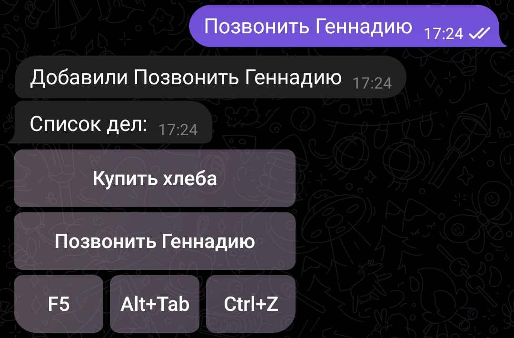

# Mister lister

[На русском](README.md)

Telegram bot for collaboration with shopping lists, tasks, etc.

[@retsil_retsim_bot](https://t.me/retsil_retsim_bot)

{width=360 height=238}

The bot's author does not guarantee the security and privacy of your lists. Please run the bot on your own for security.

Contact the author: [@uscr0](https://t.me/uscr0)

Origin of this repo: [gitlab.uscr.ru/mister-lister](https://gitlab.uscr.ru/public-projects/telegram-bots/mister-lister)

## Getting Started
- Create a list: `/new Shopping list`
- Switch between different lists: command `/list` or button `Alt+Tab`

To add items to the list, send new items to the chat as regular messages.

To delete an item from the list, press the item's button.

Functionality of the bottom row buttons:

- "F5" refreshes the list (similar to the `/show` command, applicable for shared lists)
- "Alt+Tab" switches lists (similar to the `/list` command)
- "Ctrl+Z" cancels deletion

## Collaboration
- Ask the user to find out their ID with the `/me` command.
- Give another user access to the current list: `/share <User ID>`
- Ask the user to select a list `/list`

The user with whom you've shared the list can then share the list with another user.

Users can add and delete items from the shared list without restrictions.

Each user of a shared list can only undo the deletion of items they've added themselves.